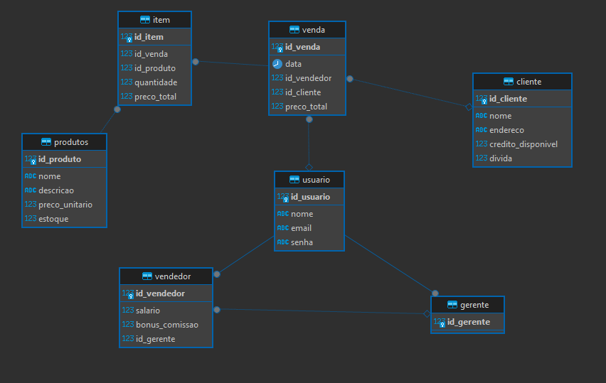

# Gerenciador de Vendas e Estoque

Este é um pequeno projeto produzido durante o programa de Residência de TIC/Software pelo Serratec. Essa aplicação tem como objetivo implementar conhecimentos adquiridos por meio da disciplina de POO, tais como toda a sua teoria e os fundamentos de programação em Java, bem como algumas coisas que aprendi por fora, tais como as bibliotecas Swing e JDBG, por mera curiosidade. Essa aplicação é básica e esta incompleta, sintam-se livres para contribuir!

# A Estrutura do Projeto

# O Diagrama do Banco de Dados

